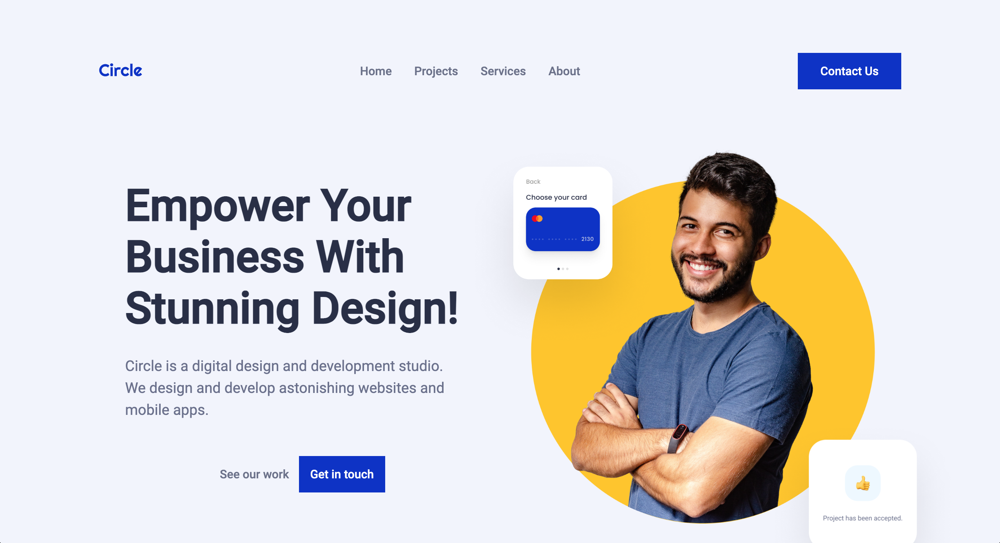

<!--
Un archivo README.md es un archivo de markdown que contiene información sobre un proyecto. Típicamente se encuentra en el directorio raíz de un proyecto y se utiliza para proporcionar documentación e instrucciones para otros que puedan querer usar o contribuir al proyecto.

Para los desarrolladores, un archivo README.md bien estructurado y bien documentado puede ser beneficioso de varias maneras. Puede ayudar a asegurar que otros puedan entender y usar fácilmente el proyecto, lo que puede conducir a más contribuciones y una comunidad más activa alrededor del proyecto. Además, puede hacer que sea más fácil para los desarrolladores incorporar a nuevos miembros del equipo y para que otros entiendan el propósito y la funcionalidad del proyecto.

Para otros desarrolladores, un archivo README.md bien estructurado y bien documentado puede ser un recurso valioso cuando se trata de entender o usar un proyecto. Puede proporcionar información sobre los objetivos, funcionalidad y cómo usar del proyecto, lo que puede ahorrar tiempo y esfuerzo al tratar de ponerse al día en un nuevo proyecto. Además, un buen README.md también puede proporcionar información sobre cómo contribuir al proyecto y directrices para hacerlo, lo que puede facilitar que otros se involucren y contribuyan al proyecto.

En el caso específico de comenzar en este mundo de desarrollo como desarrollador junior, lo cual todos ustedes, queridos estudiantes caen bajo ella, puede beneficiarse de la siguiente manera:

Tener un archivo README.md bien estructurado y bien documentado también puede ser beneficioso para los nuevos desarrolladores junior que están tratando de entrar en el mercado laboral. El mercado laboral para desarrolladores es altamente competitivo, y tener un portafolio de proyectos bien documentados y fácilmente comprensibles puede diferenciar a un desarrollador junior de otros. Un archivo README.md bien escrito demuestra la habilidad de un desarrollador para comunicar y documentar su trabajo de manera efectiva, lo cual es una habilidad importante en cualquier entorno profesional. Además, tener un portafolio de proyectos bien documentados también puede ayudar a los desarrolladores junior a entender y explicar mejor su propio trabajo, lo cual puede ser beneficioso en entrevistas laborales y otros entornos profesionales. En general, un archivo README.md bien estructurado y bien documentado puede ayudar a los desarrolladores junior a mostrar sus habilidades y destacar en un mercado laboral competitivo.
-->

<!-- Estructura -->
<!--
*** Estoy usando enlaces de estilo "referencia" de markdown para la legibilidad.
*** Los enlaces de referencia están encerrados en corchetes [ ] en lugar de paréntesis ( ).
*** Vea la parte inferior de este documento para la declaración de las variables de referencia
*** https://www.markdownguide.org/basic-syntax/#reference-style-links
-->

<!-- Por favor no borrar este elemeno, ayuda al elemento "back to top" -->

<!-- PROJECT LOGO -->

<!-- No tengo logo de marca personal (tendré que crearme uno) por lo que no añado ninguno-->

<!-- TABLE OF CONTENTS -->

  
Table of Contents

  <ol>
    <li>
      <a href="#acerca-del-proyecto">Acerca del Proyecto</a>
      <ul>
        <li><a href="#construido-con">Construido Con</a></li>
      </ul>
    </li>
    <li>
    <a href="#roadmap">Roadmap</a>
     <ul>
     <li><a href="#backlog">Back log</a></li>
        <li><a href="#road-map">Road map será seguido por trello, pdte actualiazr url</a></li>
      </ul>
    </li>
    <li><a href="#acerca">Acerca</a></li>
    <li><a href="#agradecimientos">Agradecimientos</a></li>
    <li><a href="#desafío-técnico">Desafío Técnico</a></li>
  </ol>

<!-- ABOUT THE PROJECT -->

## Acerca del Proyecto

Este proyecto es el primer proyecto desarrollado plenamente desde cero (bajo indicaciones/requisitos previas a seguir).

En el intentamos replicar el desarrollo con HTML, CSS y JS (sin framework) de un hipotetico cliente final, añadiendo funcionalidades y aspectos visuales con los conocimientos adquiridos hasta ahora en el bootcamp.

Dicho proyecto será actualizado regularmente hasta la fecha de espera.

En mi caso personal, el proyecto será trabajado en varios repositorios debido a mi movilidad y necesidad de trabajar con diferentes equipos.

Todos los commits serán registrados, incluso si son hechos desde otro repositorio.

Repositorio del proyecto final: https://github.com/jorgegomezcc/IronHack-Project-Midcourse

Repositorio de pruebas del proyecto: https://github.com/jorgegomezcc/IH-BC-Win/tree/main/Proyecto-midcourse

Proyecto final alojado en Vercel: https://iron-hack-project-midcourse-git.vercel.app/

(<a href="#readme-top">back to top</a>)

### Construido Con

Este proyecto esta desarrollado con HTMl, CSS y JavaScript sin hacer uso de frameworks.

Codigo escrito y editado con VSCODE

Trabajado tanto en Mac como en Windows

El Proyecto esta estructurado con las carpetas correspondientes a cada tipo de archivo.

(<a href="#readme-top">back to top</a>)

## Roadmap

#### Backlog

Todos los cambios se han de poder seguir y ver tanto en el repositorio de pruebas como el final, algun código ha sido testado en local y no subido en comit pero ha sido añadido al road map

#### Day One

X Analisis del proyecto 
X Estructuracion de HTML

#### Day Two

X Estructuracion del proyecto
X Proximos pasos, JS o CSS

X Investigacion funciones JS
X Creacion de primeras funciones con JS

X Testeo

#### Day Three

X Investigacion funciones JS
x Implementacion nuevas funciones con JS

X Creacion de CSS y primeros pasos (no responsive)

X Testeo

#### Day Four

X investigacion CSS 
X Editar CSS (segunda edicion de CSS (empezando responsive))

X Investigacion funciones JS
x Implementacion nuevas funciones con JS

X Testeo

#### Day five

X Repaso y limpieza del Codigo general

X Editar CSS (Tercera Edicion de CSS (responsive y no responsive))

X Investigacion funciones JS
x Implementacion nuevas funciones con JS

X Testeo

#### Day Six

X Editar CSS (Cuarta edicion de CSS (terminando boiler básico))

X Implementacion nuevas funciones con JS (edicion funciones con JS (terminando boiler basico))

#### Day Seven

X Limpieza de código y comprobacion de boiler básico

X Investigacion boiler Avanzado

X Añadir elementos boiler avanzado (CSS y JS)

#### Last Day

X Implementacion de la pagina opcional del boiler avanzado de "About Us"

X Limpieza final de código

X Edicion de algunos cambios en HTML

X Subida y comprobación de web final

(<a href="#readme-top">back to top</a>)

<!-- Acerca de mi -->

## Acerca

Desarrollado por Jorge A. Gomez

Miembro del Equipo IT de Amazon.
Estudiante de IronHack y próximo Front-End Developer.

<!-- ACKNOWLEDGMENTS -->

## agradecimientos

Principalmente a Diego por ser la persona encargada de formarnos como desarrolladores y quien nos apoya en el camino.

A Gabriel Beraducci, compañero de clase, de trabajo y amigo personal con quien sigo el camino de este bootcamp y me ayuda constantemente a avanzar.

A todos los compañeros de clase que con sus dudas y aportaciones ayudan al porvenir de este curso.

(<a href="#readme-top">back to top</a>)

## Desafío Técnico

El principal desafio, es como no puede ser de otra forma, el ser el primer desarrollo "desde cero" y "funcional" al que nos enfrentamos.

Como tal, y a pesar de conocer las bases de la tecnologia con la que desarrollamos el proyecto, es un desafio poner en marcha dichos conocimientos adquiridos.

El CSS ha resultado ser bastante mas complicado de lo que pensaba en un principio, ha sido una lucha constante de exitos y frustraciones y sobre todo horas y horas de codigo e investigacion.

El trabajar con 2 repositorios diferentes uno de "prueba" donde iba haciendo fases de testeo y otro en el que subia el codigo ya testado y avanzaba en el proyecto final

## ERRORES

El mayor error cometido durante el proyecto, ha sido sin duda empezar el css sin el responsive primero, problema silventado en la segunda edicion del css en el que empecé a trabajar con el css con la premisa de "mobile first".

Tuve algunos (varios) errores al intentar fusionar o implementar funciones de JS que con investigacion y testeo se fueron solventando.

Un road map algo desorganizado que no seguí a pie de la letra.